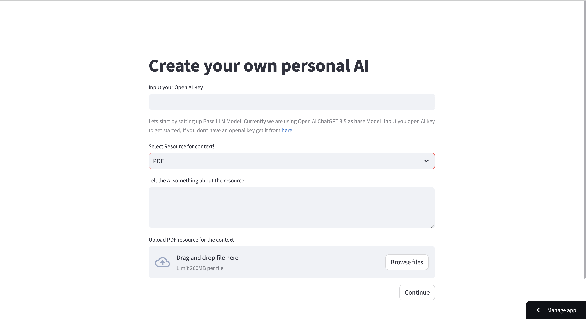
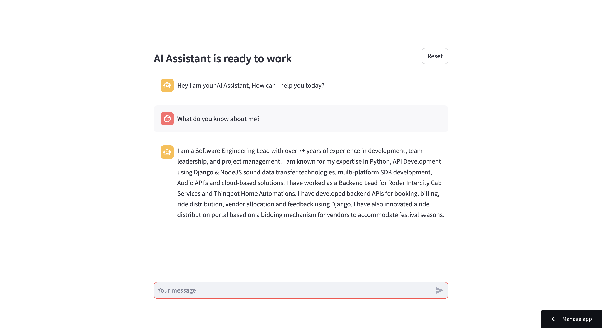

# DexGPT : Create your own custom AI.

DexGPT is a web application build on Langchain & Streamlit for creating customise AI Chatbot. The Configration include selecting of resource and adding prompt. Once the AI Assistant is created user can chat with it using a Chatbot Interface.

Checkout the application at: https://dexgpt.streamlit.app/

## Installation

**Clone the repo** 

```shell
git clone https://github.com/dextrop/dexgpt.git
```

**Make sure you use Virtual Environment for the project**

- install virtualenv package

```shell
pip3 install virtualenv
```

- Create Virtual Environment

```shell
virtualenv -p python3 venv
```

Run the project using `streamlit run app.py`

## Application Demo ( Video / Images )

- Configration Screen
  

- Chatbot Screen
  